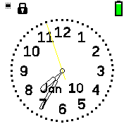
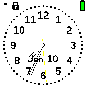

# banglejs-2-smart-clock-size #

calculates position and size of an analog clock on a Bangle.js 2

This module calculates the size of an analog clock face for the [Bangle.js 2](https://www.espruino.com/Bangle.js2) depending on how much space is already occupied by any loaded widgets.

If those widgets are small and well placed in the corners of a Bangle's display, this module allows a clock face to become significantly larger than a [simple clock size calculation](https://github.com/rozek/banglejs-2-simple-clock-size).

<table>
 <tr valign="top">
   <td align="center"><br>simple clock size calculator</td>
   <td align="center"><br>smart clock size calculator</td>
 </tr>
</table>

## Usage ##

Within a clock implementation, the module may be used as follows:

```
let Clockwork = require(...);
Clockwork.windUp({
  size: require('https://raw.githubusercontent.com/rozek/banglejs-2-smart-clock-size/main/ClockSize.js'),
  ...
}});
```

## Example ##

The following code shows a complete example for a (still simple) analog clock using this clock size calculator:

```
let Clockwork = require('https://raw.githubusercontent.com/rozek/banglejs-2-simple-clockwork/main/Clockwork.js');

Clockwork.windUp({
  size:  require('https://raw.githubusercontent.com/rozek/banglejs-2-smart-clock-size/main/ClockSize.js'),
  face:  require('https://raw.githubusercontent.com/rozek/banglejs-2-twelve-fold-clock-face/main/ClockFace.js'),
  hands: require('https://raw.githubusercontent.com/rozek/banglejs-2-simple-clock-hands/main/ClockHands.js'),
},{
  Foreground:'#FFFFFF', Background:'#000000', Seconds:'#FFFF00',
  withDots:true
});
```

## License ##

[MIT License](LICENSE.md)
